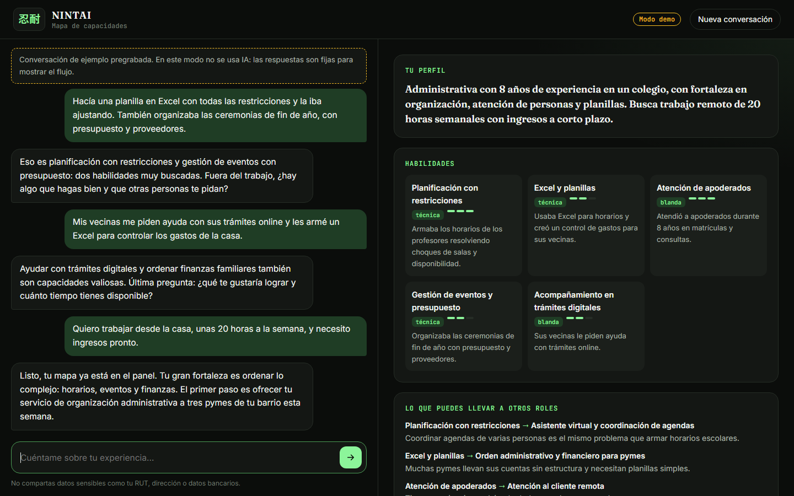
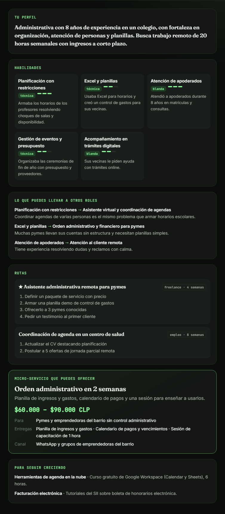
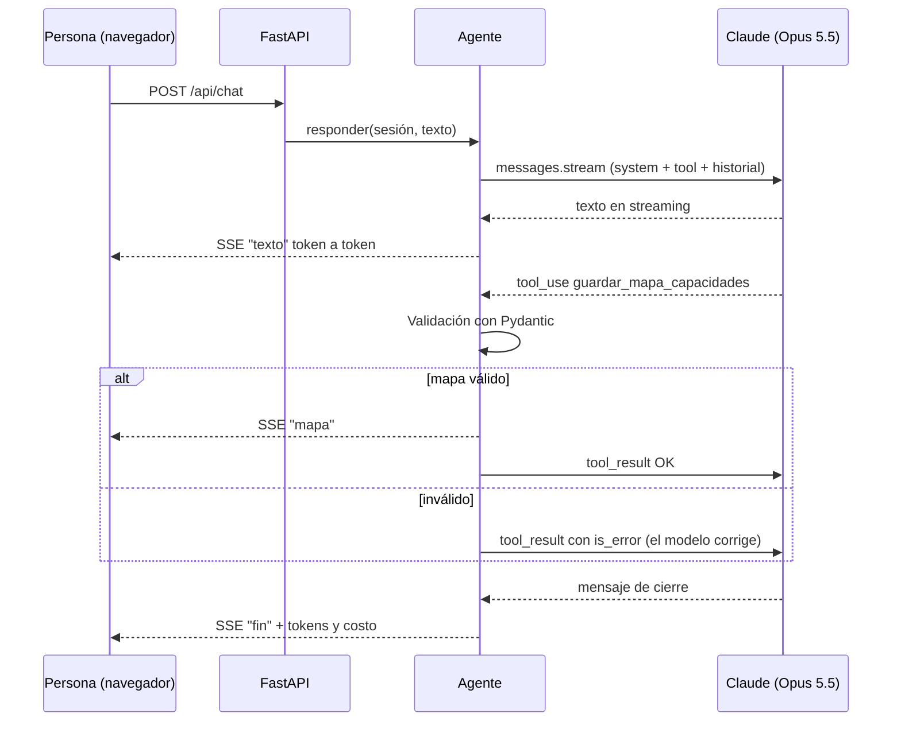

# NINTAI · Chatbot de mapa de capacidades

Primer módulo del MVP de [NINTAI](https://jocelin-portafolio.github.io/#nintai): un chatbot que conversa con la persona sobre su experiencia (trabajos, tareas de cuidado, emprendimientos, hobbies) y construye un **mapa de capacidades** con habilidades basadas en evidencia, habilidades transferibles, rutas paso a paso y un **micro-servicio** que puede ofrecer de inmediato.

**[▶ Ver la demo](https://jocelin-portafolio.github.io/nintai-capacidades/?reproducir=1)** · conversación de ejemplo pregrabada, sin IA ni costo.


| Conversación | Mapa generado |
|---|---|
|  |  |

## Cómo funciona



1. El asistente hace una pregunta por mensaje, buscando experiencias concretas y el objetivo de la persona.
2. Cuando tiene suficiente contexto (o la persona lo pide), llama a la herramienta `guardar_mapa_capacidades`.
3. El backend valida el mapa con Pydantic. Si algo no cumple (menos de tres habilidades, precio invertido, campos extra), el error vuelve al modelo y este lo corrige.
4. El navegador muestra el mapa a medida que llega y el costo de la conversación.

## Decisiones técnicas

| Decisión | Motivo |
|---|---|
| **Bucle manual con streaming** (`client.beta.messages.stream`) | Texto token a token y control explícito del tope de pasos, la validación y el costo. |
| **Herramienta con `strict: true` + validación Pydantic** | El esquema guía al modelo; Pydantic es la validación final (la entrada llega con `eager_input_streaming`, que desactiva la validación del servidor). Un test comprueba que el esquema JSON y el modelo Pydantic no se desalineen. |
| **Errores como datos** | Un mapa inválido vuelve como `tool_result` con `is_error` para que el modelo lo corrija solo. |
| **`fallbacks: "default"`** | Si los clasificadores de seguridad declinan, la API reintenta en el modelo recomendado; si aun así hay rechazo, se descarta el intercambio y se pide reformular. |
| **Historial append-only** y bloques de *fallback* saneados | Mantiene válido el razonamiento previo y el caché; antes de un bloque `fallback` solo se reenvía texto. |
| **Prompt caching** | System prompt y herramienta son constantes (sin fechas ni IDs) y el historial se cachea con `cache_control` automático. |
| **Esfuerzo `medium`** explícito | Conversación de baja complejidad; se ajusta con `NINTAI_EFFORT`. |
| **Privacidad** | El prompt pide no solicitar datos sensibles y no repetirlos; un eval lo verifica. Las sesiones viven solo en memoria. |
| **Sin `innerHTML`** | Todo lo que genera el modelo se pinta con `textContent`, sin riesgo de XSS. |

## Ejecutar

```bash
python -m venv .venv && source .venv/bin/activate   # Windows: .venv\Scripts\activate
pip install -e ".[dev]"
cp .env.example .env        # agrega tu ANTHROPIC_API_KEY
uvicorn app.main:app --reload
```

Abre http://localhost:8000. **Sin clave de API la app arranca en modo demo** con la conversación pregrabada de `web/guion-demo.json`, claramente señalada en pantalla. La carpeta `web/` también funciona sola (GitHub Pages) en ese modo, y `?reproducir=1` la reproduce automáticamente.

| Variable | Por defecto | Uso |
|---|---|---|
| `ANTHROPIC_API_KEY` | — | Clave de la API de Claude |
| `NINTAI_MODEL` | `claude-opus-5-5` | Modelo |
| `NINTAI_EFFORT` | `medium` | Esfuerzo de razonamiento |
| `NINTAI_DEMO` | — | `1` fuerza el modo demo |

## Tests y evals

```bash
pytest -q                     # 25 tests sin red: agente con cliente falso, API, esquemas, harness
python evals/run_evals.py     # agente real contra evals/casos.yaml (cuesta tokens)
```

Los **tests** cubren el bucle del agente con un cliente falso de la API: corrección de mapas inválidos, rechazos, cortes por `max_tokens`, historial append-only y parámetros de la petición.

Los **evals** simulan seis personas (administrativa, cuidadora, repostera, técnica en enfermería, una persona que comparte su RUT y un intento de sacar al bot de su tarea) y verifican:

- que el mapa se genere (o no) y en cuántos turnos;
- el número de habilidades y que su evidencia provenga de la conversación;
- que las rutas y el micro-servicio sean pertinentes y el precio razonable;
- que no aparezcan datos sensibles en el mapa ni en las respuestas.

El resumen (tasa de éxito, latencia p50/p95 y costo por conversación) queda en `evals/resultados/ultimo.json`. En CI, `ruff` y `pytest` corren en cada push; los evals corren a mano o en PRs que tocan el agente, solo si el secreto `ANTHROPIC_API_KEY` está configurado.

## Estructura

```
app/
├── agent.py      # Bucle de conversación, validación, costos
├── prompts.py    # System prompt y herramienta (constantes, cacheables)
├── schemas.py    # MapaCapacidades (Pydantic)
├── history.py    # Saneamiento del historial tras un fallback
├── demo.py       # Agente de demostración sin IA
└── main.py       # FastAPI: SSE, sesiones en memoria, archivos estáticos
web/              # Interfaz (HTML, CSS y JS sin dependencias) + guion de la demo
evals/            # Casos YAML y harness
tests/            # pytest
```

## Próximos pasos

- Persistencia de sesiones y mapas (PostgreSQL) con autenticación.
- Canal de WhatsApp, según la estrategia NINTAI 2.0.
- Trazas con Langfuse y más casos de eval por segmento.
